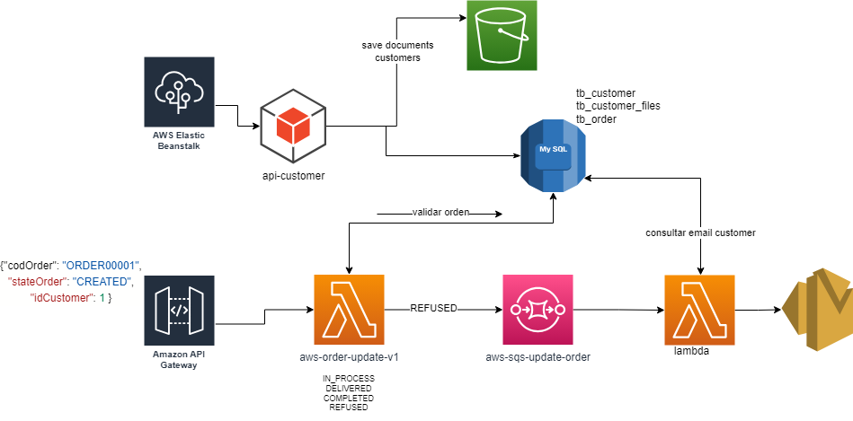

# AWS JAVA USO DE SERVICIOS(S3,BEANSTALK,LAMBDA,RDS,SQS,SES)

## Description

Proyecto donde se hace uso de algunos servicios de aws:

- Se uso beanstalk para el despliegue proyecto demo-clientes, recomienda pasar la el .properties a un .yml
- El motor de base de datos usado fue MySql
- El proyecto aws lambda fue realizado con java JDBC. 
- No se uso un archivo CloudFormation para la creacion de servicios, por lo cual se creo todo a traves de la plataforma aws.

## Table of Contents (Optional)

- [Installation](#installation)
- [Usage](#usage)
- [Credits](#credits)
- [License](#license)

## Installation

Java 17, mysql, maven, git

## Credits

Joaquin Huauya Arotinco

## License

🏆 Joaquin Huauya Arotinco

